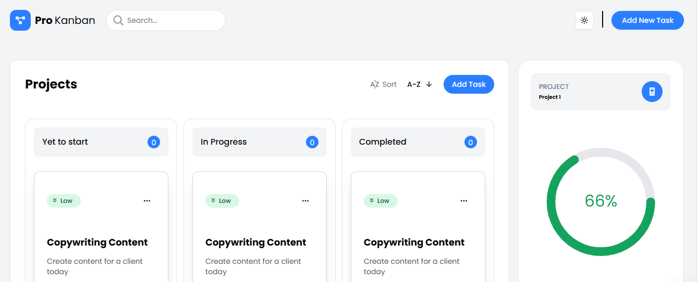

# 🗂️ Kanban Board App

A modern and responsive Kanban board built with **React**, **Next.js**, and **TypeScript**, supporting dynamic theme switching and reusable component architecture.

## ✨ Features

- 🧩 **Drag-and-drop task management**
- 🎨 **Light/Dark theme switching** with persistent user preference
- ♻️ **Reusable and modular components**
- ⚡ **Fast performance** using Next.js optimization
- 📱 **Responsive design** across devices

## 🚀 Technologies Used

- **React** – component-based UI development
- **Next.js** – server-side rendering and routing
- **TypeScript** – type safety and better developer experience
- **Tailwind CSS** *(optional)* – for styling (if used)
- **Context API / Zustand / Redux** *(if any state management was used)*

## 🖼️ Preview



## 🔧 Getting Started

### Prerequisites

- Node.js (v16 or later)
- npm or yarn

### Installation

```bash
# Clone the repo
git clone https://github.com/Chirantan2002/Kanban-Board.git

# Navigate to project folder
cd kanban-board

# Install dependencies
npm install
# or
yarn install
